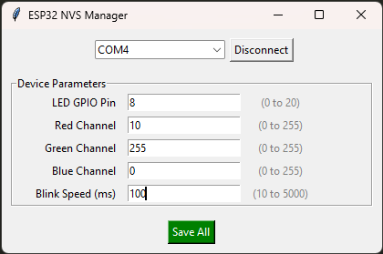

# ESP32 Smart NVS Manager

An easy-to-use system for managing ESP32 parameters (IPs, timeouts, sensor offsets, LED settings) via USB Serial without ever needing to re-flash your firmware. 

The project features a **Schema-based architecture**: the ESP32 defines its own configuration rules (data types, min/max values, labels), and the Python UI dynamically builds itself based on that information.


## 🖥 Graphical User Interface


## 🚀 Key Features
- **Dynamic UI Generation**: Adding a new parameter in the C++ code automatically creates a new input field in the Python UI.
- **On-the-Fly Updates**: Change LED colors, blink frequencies, or pin assignments in real-time.
- **Persistent Storage**: All settings are saved to the ESP32's Non-Volatile Storage (NVS).
- **Double Validation**: Input is validated both in the Python UI (client-side) and on the ESP32 (server-side) for maximum safety.
- **Zero-Config Python**: Runs via `pipx` with no manual virtual environment management.

## 🛠 Hardware Setup
- **Microcontroller**: ESP32-C3 (tested on C3 SuperMini), but compatible with any ESP32.
- **LED**: WS2812 (NeoPixel) connected to **GPIO 8**.
- **Connection**: USB cable for both power and Serial communication.

## 📂 Project Structure
```text
├── firmware/
│   └── main.ino          # ESP32 Arduino Code
└── tool/
    └── config_tool.py    # Python GUI Tool
├── GUI.png               # Screenshot
└── README.md
```

## ⚙️ Software Requirements

### ESP32 Side (Arduino IDE)
Install the following libraries via the Library Manager:
- **ArduinoJson** (v7.x)
- **Adafruit NeoPixel**
- **Preferences** (Built-in)

### Python Side
- **Python 3.8+**
- **pipx** (Recommended) or **pyserial**

## 🚦 Getting Started

### 1. Flash the ESP32
1. Open `firmware/main.ino` in the Arduino IDE.
2. Select your board (e.g., ESP32C3 Dev Module).
3. Ensure **USB CDC On Boot** is enabled (especially for C3/S3 boards).
4. Click **Upload**.

### 2. Run the Configuration Tool
You don't need to install dependencies manually. Using `pipx`, you can run the script directly from the root folder:

```bash
pipx run tool/config_tool.py
```

*Note: If you don't have pipx, simply run `pip install pyserial` and then `python tool/config_tool.py`.*

## 📖 How it Works

### The Schema
The ESP32 holds a `Parameter` array that defines the configuration "contract":
```cpp
Parameter schema[] = {
    {"led_pin", "LED GPIO Pin", "int", 0, 20},
    {"red",     "Red Channel",  "int", 0, 255},
    ...
};
```
When you click **Connect** in the Python tool, it sends a `GET_SCHEMA` command. The ESP32 replies with a JSON object containing the current values and the rules.

### Validation
If you try to set a value outside the defined `min_val` or `max_val`, the Python tool will block the request and show an error. As a secondary safety layer, the ESP32 also validates the values before writing them to the NVS memory.

## 📄 License
This project is licensed under the GPL3 License - see the LICENSE file for details.